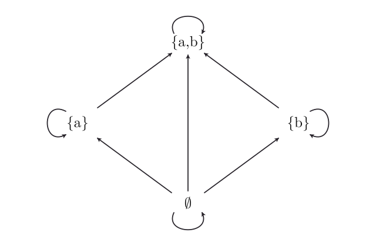

1. hét: Matematikai logika és halmazalgebra
===========================================

Az első héten pontos nyelvet adunk az állításokhoz és a
matematikai bizonyításokhoz, majd ezt a müdszert halmazalgebrai feladatokon
alkalmazzuk. 

Állítások és bizonyítási szabályok
----------------------------------------

.. math::

   \mathsf{Prop}
   ::= A\mid B\mid C\mid\cdots
   \mid A\land B
   \mid A\lor B
   \mid A\to B
   \mid\bot
   \mid\top .

Itt :math:`A,B,C` tipikus állításváltozók, :math:`\land` az „és”
(konjunkció), :math:`\lor` a „vagy” (diszjunkció), :math:`\to` pedig a
„ha …, akkor …” (implikáció) műveletének jele. A negáció származtatott
művelet:

.. math::

   \neg A\mathrel{:=}A\to\bot .

A :math:`\neg A` formula jelentése: ha :math:`A` igaz lenne, akkor
ellentmondásra jutnánk. 

.. math::

   A\leftrightarrow B\mathrel{:=}(A\to B)\land(B\to A).

:math:`A\leftrightarrow B` jelentése: :math:`A` és :math:`B` ekvivalensek.

Boole-értékelések
~~~~~~~~~~~~~~~~~

Az állítások egyik legegyszerűbb jelentéselméletét az igazságértékelések adják.
Legyen

.. math::

   \mathsf{Bool}=\{0,1\},
   \qquad
   \llbracket\cdot\rrbracket:\mathsf{Prop}\to\mathsf{Bool},

ahol :math:`0` a hamis, :math:`1` az igaz. A konjunkció és
a diszjunkció értékét a minimum, illetve a maximum segítségével adhatjuk meg:

.. math::

   \llbracket A\land B\rrbracket
   =\min\{\llbracket A\rrbracket,\llbracket B\rrbracket\},
   \qquad
   \llbracket A\lor B\rrbracket
   =\max\{\llbracket A\rrbracket,\llbracket B\rrbracket\}.

Az implikáció igazságtáblája:

.. math::

   \begin{array}{cc|c}
   \llbracket A\rrbracket & \llbracket B\rrbracket
     & \llbracket A\to B\rrbracket\\
   \hline
   0&0&1\\
   0&1&1\\
   1&0&0\\
   1&1&1
   \end{array}

Ez az úgynevezett **Philón-féle kondicionális**. Egy implikáció pontosan
akkor hamis, ha az előtag igaz, az utótag pedig hamis. 

A negáció igazságértéke:

.. math::

   \llbracket\neg A\rrbracket=1-\llbracket A\rrbracket.

Következtetések (bizonyítás)
~~~~~~~~~~~~~~~~~~~~~~~~~~~~

A továbbiakban azt vizsgáljuk, hogy az állítások miként igazolhatók a felépítésük alapján
bizonyítási szabályok segítségével.

A követketetések ilyen alakúak:

.. math::

   \frac{A_1,\ldots,A_n}{B}.

A vonal feletti dolgok a feltételek (premisszák), a vonal alatti a következmény vagy konklúzió. Ha ezt igazságértékelős szemmel nézzük, akkor az van, hogy egy ilyen következtetés **érvényes,** ha minden olyan esetben, amikor a feltételek igazak, akkor a konklúzió is igaz.

Bevezetési és kiküszöbölési szabályok
~~~~~~~~~~~~~~~~~~~~~~~~~~~~~~~~~~~~~~

Minden logikai művelethez kétféle szabály tartozik.

**Bevezetési szabály**
   Megmondja, milyen feltételekből állíthatjuk elő az adott művelettel képzett
   állítást.

**Kiküszöbölési szabály**
   Megmondja, milyen információt nyerhetünk ki egy már rendelkezésre álló
   összetett állításból.

A bizonyítás egy fa. A levelek a feltevések, a fa gyökere pedig a bizonyított állítás.

Konjunkció
~~~~~~~~~~

Bevezetés — :math:`\land I`
   :math:`A\land B` levezethetőségének feltétele :math:`A` és :math:`B` levezethetősége:

   .. math::

      \frac{A\qquad B}{A\land B}\;\land I.

Kiküszöbölés — :math:`\land E_1`, :math:`\land E_2`
   Ha :math:`A\land B` levezethető, akkor :math:`A` is és :math:`B` is levezethet:

   .. math::

      \frac{A\land B}{A}\;\land E_1
      \qquad
      \frac{A\land B}{B}\;\land E_2.

Diszjunkció
~~~~~~~~~~~

Bevezetés — :math:`\lor I_1`, :math:`\lor I_2`
   Egy :math:`A\lor B` diszjunkció levezethető, ha :math:`A` és :math:`B` közül ***legalább az egyik*** levezethető. (Ha valami levezethető, akkor büntetlenül hozzávagyolhatunk bármit.) 

   .. math::

      \frac{A}{A\lor B}\;\lor I_1
      \qquad
      \frac{B}{A\lor B}\;\lor I_2.

Kiküszöbölés — :math:`\lor E`
   Az esetészétválasztás elve: ha :math:`A\lor B` igaz, és :math:`A`-ból is következik :math:`C` és :math:`B`-ből is következik :math:`C`, akkor :math:`C` is igaz: 

   .. math::

      \frac{
        A\lor B
        \qquad
        \begin{array}{c}[A]\\ \vdots\\ C\end{array}
        \qquad
        \begin{array}{c}[B]\\ \vdots\\ C\end{array}
      }{C}\;\lor E.

Implikáció
~~~~~~~~~~

Bevezetés — :math:`\to I`
   Ideiglenesen feltesszük :math:`A`-t. Ha ebből le tudjuk vezetni
   :math:`B`-t, akkor minden feltétel nélkül: :math:`A\to B`:

   .. math::

      \frac{\begin{array}{c}[A]\\ \vdots\\ B\end{array}}{A\to B}\;\to I.

Kiküszöbölés — :math:`\to E`
   Az implikáció kiküszöbölése a *modus ponens*, "Ha :math:`A`, akkor :math:`B`. De :math:`A`. Tehát :math:`B`.": 

   .. math::

      \frac{A\to B\qquad A}{B}\;\to E.

Hamisból minden következik, a kizárt harmadik elve
~~~~~~~~~~~~~~~~~~~~~~~~~~~~~~~~~~~~~~~~~~~~~~~~~~~~

.. math::

   \frac{\bot}{A}\;\bot E.

A kizárt harmadik elve (*law of excluded middle*, LEM) a klasszikus logikában:

.. math::

   A\lor\neg A.

.. important:: Ideiglenes feltevések

   A levezetésfában szögletes zárójelben szereplő levelek ideiglenes
   feltételezések. Az implikáció bevezetése (:math:`\to I`) és az
   esetszétválasztás (:math:`\lor E`) egy-egy ilyen feltételezést eldob.

Műveleti szabályok
------------------

A konjunkció és a diszjunkció kommutatív:

.. math::

   A\land B \leftrightarrow B\land A,
   \qquad
   A\lor B \leftrightarrow B\lor A.

Mindkét művelet asszociatív:

.. math::

   (A\land B)\land C \leftrightarrow A\land(B\land C),

.. math::

   (A\lor B)\lor C \leftrightarrow A\lor(B\lor C).

Egymásra nézve disztributívak:

.. math::

   A\land(B\lor C)
   \leftrightarrow
   (A\land B)\lor(A\land C),

.. math::

   A\lor(B\land C)
   \leftrightarrow
   (A\lor B)\land(A\lor C).

Példa: a konjunkció kommutativitása
~~~~~~~~~~~~~~~~~~~~~~~~~~~~~~~~~~~

**Állítás:**

.. math::

   A\land B\to B\land A.

**Bizonyítás:** tegyük fel, hogy :math:`A\land B` igaz. A
:math:`\land E_2` szabállyal megkapjuk :math:`B`-t, a :math:`\land E_1`
szabállyal :math:`A`-t. Ezekből :math:`\land I` segítségével felépítjük
:math:`B\land A`-t, majd lezárjuk az eredeti feltevést.

.. math::

   \begin{prooftree}
   \AXC{$\hyp{A\land B}{1}$}
   \RL{$\land E_2$}
   \UIC{$B$}
   \AXC{$\hyp{A\land B}{1}$}
   \RL{$\land E_1$}
   \UIC{$A$}
   \RL{$\land I$}
   \BIC{$B\land A$}
   \RL{$\to I\;1$}
   \UIC{$A\land B\to B\land A$}
   \end{prooftree}

**Interaktív ellenőrzés.** A motor csak a gomb megnyomásakor töltődik be.

.. raw:: html

   <iframe class="rocq-frame rocq-frame--proof"
     data-proof="and_comm"
     src="../_static/rocq/logika-playground.html?proof=and_comm"
     title="A konjunkció kommutativitásának interaktív ellenőrzése"
     loading="lazy" allow="clipboard-write"></iframe>

Példa: a diszjunkció kommutativitása
~~~~~~~~~~~~~~~~~~~~~~~~~~~~~~~~~~~~

**Állítás:**

.. math::

   A\lor B\to B\lor A.

**Bizonyítás:** tegyük fel, hogy :math:`A\lor B` igaz. Két esetet kell
vizsgálni.

* Ha :math:`A` igaz, akkor a :math:`\lor I_2` szabállyal :math:`B\lor A`
  következik.
* Ha :math:`B` igaz, akkor a :math:`\lor I_1` szabállyal ugyancsak
  :math:`B\lor A` következik.

Mivel a két ág azonos konklúzióra vezet, a :math:`\lor E` szabállyal
lezárható az esetszétválasztás.

.. math::

   \begin{prooftree}
   \AXC{$\hyp{A\lor B}{1}$}
   \AXC{$\hyp{A}{2}$}
   \RL{$\lor I_2$}
   \UIC{$B\lor A$}
   \AXC{$\hyp{B}{3}$}
   \RL{$\lor I_1$}
   \UIC{$B\lor A$}
   \RL{$\lor E\;2,3$}
   \TIC{$B\lor A$}
   \RL{$\to I\;1$}
   \UIC{$A\lor B\to B\lor A$}
   \end{prooftree}

**Interaktív ellenőrzés.**

.. raw:: html

   <iframe class="rocq-frame rocq-frame--proof"
     data-proof="or_comm"
     src="../_static/rocq/logika-playground.html?proof=or_comm"
     title="A diszjunkció kommutativitásának interaktív ellenőrzése"
     loading="lazy" allow="clipboard-write"></iframe>

Példa: a disztributivitás egyik iránya
~~~~~~~~~~~~~~~~~~~~~~~~~~~~~~~~~~~~~~

**Állítás:**

.. math::

   A\land(B\lor C)\to(A\land B)\lor(A\land C).

Tegyük fel, hogy :math:`A\land(B\lor C)` igaz. Ebből :math:`A` és
:math:`B\lor C` is következik. Nem tudjuk, hogy :math:`B` vagy :math:`C`
igaz-e, ezért két esetet vizsgálunk.

* Ha :math:`B` igaz, akkor :math:`A\land B`, ezért
  :math:`(A\land B)\lor(A\land C)`.
* Ha :math:`C` igaz, akkor :math:`A\land C`, ezért ugyanaz a diszjunkció
  következik.

Mivel mindkét eset ugyanarra az eredményre vezet, a :math:`\lor E` szabály
lezárja az esetszétválasztást.

.. container:: proof-tree proof-tree-wide

   .. math::

      \begin{prooftree}
      \AXC{$\hyp{A\land(B\lor C)}{1}$}
      \RL{$\land E_2$}
      \UIC{$B\lor C$}
      \AXC{$\hyp{A\land(B\lor C)}{1}$}
      \RL{$\land E_1$}
      \UIC{$A$}
      \AXC{$\hyp{B}{2}$}
      \RL{$\land I$}
      \BIC{$A\land B$}
      \RL{$\lor I_1$}
      \UIC{$(A\land B)\lor(A\land C)$}
      \AXC{$\hyp{A\land(B\lor C)}{1}$}
      \RL{$\land E_1$}
      \UIC{$A$}
      \AXC{$\hyp{C}{3}$}
      \RL{$\land I$}
      \BIC{$A\land C$}
      \RL{$\lor I_2$}
      \UIC{$(A\land B)\lor(A\land C)$}
      \RL{$\lor E\;2,3$}
      \TIC{$(A\land B)\lor(A\land C)$}
      \RL{$\to I\;1$}
      \UIC{$A\land(B\lor C)\to(A\land B)\lor(A\land C)$}
      \end{prooftree}

**Interaktív ellenőrzés.**

.. raw:: html

   <iframe class="rocq-frame rocq-frame--proof"
     data-proof="and_or_distributive"
     src="../_static/rocq/logika-playground.html?proof=and_or_distributive"
     title="A disztributivitás interaktív ellenőrzése"
     loading="lazy" allow="clipboard-write"></iframe>

Strukturális szabályok
----------------------

Láncszabály
~~~~~~~~~~~

A láncszabály segítségével egymás után alkalmazhatjuk a rendelkezésünkre
álló implikációkat.

**Állítás:**

.. math::

   (A\to B)\to((B\to C)\to(A\to C)).

Tegyük fel, hogy :math:`A\to B` és :math:`B\to C`. Az :math:`A\to C`
igazolásához ideiglenesen feltesszük :math:`A`-t. Ebből az első
implikációval :math:`B`, majd a másodikkal :math:`C` következik.

.. math::

   \begin{prooftree}
   \AXC{$\hyp{B\to C}{2}$}
   \AXC{$\hyp{A\to B}{1}$}
   \AXC{$\hyp{A}{3}$}
   \RL{$\to E$}
   \BIC{$B$}
   \RL{$\to E$}
   \BIC{$C$}
   \RL{$\to I\;3$}
   \UIC{$A\to C$}
   \RL{$\to I\;2$}
   \UIC{$(B\to C)\to(A\to C)$}
   \RL{$\to I\;1$}
   \UIC{$(A\to B)\to((B\to C)\to(A\to C))$}
   \end{prooftree}

**Interaktív ellenőrzés.**

.. raw:: html

   <iframe class="rocq-frame rocq-frame--proof"
     data-proof="chain_rule"
     src="../_static/rocq/logika-playground.html?proof=chain_rule"
     title="A láncszabály interaktív ellenőrzése"
     loading="lazy" allow="clipboard-write"></iframe>

Az igaz mindenből következik (gyengítés)
~~~~~~~~~~~~~~~~~~~~~~~~~~~~~~~~~~~~~~~~

**Állítás:**

.. math::

   A\to(B\to A).

Ha :math:`A` igaz, ha :math:`B`, akkor is igaz.

.. math::

   \begin{prooftree}
   \AXC{$\hyp{A}{1}$}
   \LL{$\hyp{B}{2}$}
   \RL{$\to I\;2$}
   \UIC{$B\to A$}
   \RL{$\to I\;1$}
   \UIC{$A\to(B\to A)$}
   \end{prooftree}

**Interaktív ellenőrzés.**

.. raw:: html

   <iframe class="rocq-frame rocq-frame--proof"
     data-proof="weakening"
     src="../_static/rocq/logika-playground.html?proof=weakening"
     title="A gyengítés interaktív ellenőrzése"
     loading="lazy" allow="clipboard-write"></iframe>

De Morgan-azonosságok
----------------------------

.. math::

   \neg(A\lor B)\leftrightarrow(\neg A\land\neg B),

.. math::

   \neg(A\land B)\leftrightarrow(\neg A\lor\neg B).

.. math::

   (\neg A\lor B)\leftrightarrow(A\to B),

Példa: De Morgan egyik iránya
~~~~~~~~~~~~~~~~~~~~~~~~~~~~~~~~~

**Állítás:**

.. math::

   \neg(A\lor B)\to\neg A\land\neg B.

A negáció definícióját kiírva ezt kell bizonyítanunk:

.. math::

   ((A\lor B)\to\bot)
   \to
   (A\to\bot)\land(B\to\bot).

Ha :math:`A` igaz volna, akkor :math:`A\lor B` is igaz lenne, ami ellentmond
:math:`\neg(A\lor B)`-nek. Ezért :math:`\neg A`. Ugyanez a gondolat
:math:`B`-re is működik, tehát :math:`\neg B`; a két eredményt
konjunkcióval kapcsoljuk össze.

.. math::

   \begin{prooftree}
   \AXC{$\hyp{\neg(A\lor B)}{1}$}
   \AXC{$\hyp{A}{2}$}
   \RL{$\lor I_1$}
   \UIC{$A\lor B$}
   \RL{$\to E$}
   \BIC{$\bot$}
   \RL{$\to I\;2$}
   \UIC{$\neg A$}
   \AXC{$\hyp{\neg(A\lor B)}{1}$}
   \AXC{$\hyp{B}{3}$}
   \RL{$\lor I_2$}
   \UIC{$A\lor B$}
   \RL{$\to E$}
   \BIC{$\bot$}
   \RL{$\to I\;3$}
   \UIC{$\neg B$}
   \RL{$\land I$}
   \BIC{$\neg A\land\neg B$}
   \RL{$\to I\;1$}
   \UIC{$\neg(A\lor B)\to\neg A\land\neg B$}
   \end{prooftree}

**Interaktív ellenőrzés.**

.. raw:: html

   <iframe class="rocq-frame rocq-frame--proof"
     data-proof="de_morgan"
     src="../_static/rocq/logika-playground.html?proof=de_morgan"
     title="De Morgan egyik irányának interaktív ellenőrzése"
     loading="lazy" allow="clipboard-write"></iframe>

Példa: diszjunkcióból implikáció
~~~~~~~~~~~~~~~~~~~~~~~~~~~~~~~~

**Állítás:**

.. math::

   (\neg A\lor B)\to(A\to B).

Tegyük fel, hogy :math:`\neg A\lor B`, majd az implikáció igazolásához azt
is, hogy :math:`A`.

* A :math:`\neg A` esetben :math:`A` és :math:`\neg A` ellentmondást ad;
  :math:`\bot`-ból pedig :math:`B` is következik.
* A :math:`B` esetben a cél közvetlenül teljesül.

Az esetszétválasztásból tehát :math:`B`, a két ideiglenes feltétel lezárásával
pedig a kívánt állítás következik.

.. math::

   \begin{prooftree}
   \AXC{$\hyp{\neg A\lor B}{1}$}
   \AXC{$\hyp{\neg A}{2}$}
   \AXC{$\hyp{A}{3}$}
   \RL{$\to E$}
   \BIC{$\bot$}
   \RL{$\bot E$}
   \UIC{$B$}
   \AXC{$\hyp{B}{4}$}
   \RL{$\lor E\;2,4$}
   \TIC{$B$}
   \RL{$\to I\;3$}
   \UIC{$A\to B$}
   \RL{$\to I\;1$}
   \UIC{$(\neg A\lor B)\to(A\to B)$}
   \end{prooftree}

**Interaktív ellenőrzés.**

.. raw:: html

   <iframe class="rocq-frame rocq-frame--proof"
     data-proof="or_to_imp"
     src="../_static/rocq/logika-playground.html?proof=or_to_imp"
     title="A diszjunkcióból implikáció bizonyításának interaktív ellenőrzése"
     loading="lazy" allow="clipboard-write"></iframe>

.. admonition:: Házi feladat

   Tegyük fel a kizárt harmadik elvét, vagyis hogy :math:`A\lor\neg A` igaz.
   Bizonyítandó a másik irány:

   .. math::

      (A\to B)\to(\neg A\lor B).

Boole-algebrai olvasat
~~~~~~~~~~~~~~~~~~~~~~~~

A :math:`\land` műveletet logikai szorzásnak, a :math:`\lor` műveletet
logikai összeadásnak is nevezik. A hamisat :math:`0`, az igazat :math:`1`
jelölheti. Ebben az olvasatban az implikáció a logikai exponenciális:
:math:`A\to B` alakjának :math:`B^A` felel meg.

Például az

.. math::

   A^{B+C}=A^B\cdot A^C

azonosság egyik iránya logikai jelöléssel:

.. math::

   ((B\lor C)\to A)\to((B\to A)\land(C\to A)).

.. _lecture1-interactive:

Kvantorok
---------

Az elsőrendű logikában az állítások már dolgoktól (objektumoktól, individuumoktól) is függhetnek. Legyen :math:`U` a vizsgált dolgok univerzuma és

.. math::

   A : U \to\mathsf{Prop},

Ekkor :math:`A` egy :math:`U`-n értelmezett **predikátum**: olyan állítás értékű függvény, aminek konkrét :math:`A(x)` alakja attól függ, mi :math:`x`.

A propozícióképzést így kiterjesztjük két új operátorral: :math:`\forall` ("minden") és :math:`\exists` ("létezik"):

.. math::

   \mathsf{Prop}::= \ldots\mid \forall x\,A(x)\mid \exists x\,A(x)

Univerzális kvantor
~~~~~~~~~~~~~~~~~~~

Bevezetés — :math:`\forall I`
   Ha egy tetszőlegesen választott :math:`x:U` elemre igazoltuk
   :math:`A(x)`-et, akkor mindenre igazoltuk. (Ha van egy egységes eljárásunk, ami minden :math:`x:U`-ről kihozza, hogy az :math:`A(x)` tulajdonságú, akkor mindenki :math:`A(x)` tulajdonságú.)

   .. math::

      \frac{
        \begin{array}{c}[x:U]\\ \vdots\\ A(x)\end{array}
      }{\forall x\,A(x)}\;\forall I.

Kiküszöbölés — :math:`\forall E`
   Egy minden elemre igaz állítást egy konkrét :math:`t` elemre is igaz:

   .. math::

      \frac{\forall x\,A(x)}{A(t)}\;\forall E.

Megjegyzés az univerzális kvantorról
~~~~~~~~~~~~~~~~~~~~~~~~~~~~~~~~~~~~

Vegyük észre, hogy a "minden" operátor működése nagyon hasonlít a "ha,... akkor..." működésére. Egyfelől:

.. math::

      \frac{
        \begin{array}{c}[x:U]\\ \vdots\\ A(x)\end{array}
      }{\forall x:U,\,A(x)}

olyan, mintha az :math:`U\to A` bevezetési szabálya lenne, másfelől a

.. math::

      \frac{t:U\quad\forall x:U,\,A(x)}{A(t)}

a :math:`U\to A` kiküszöbölési szabályára hajaz.

Másfelől a "minden" kvantor egy végtelen konjunkciónak is megfelel.

Egzisztenciális kvantor
~~~~~~~~~~~~~~~~~~~~~~~

Bevezetés — :math:`\exists I`
   Egy konkrét :math:`t` tanú és ennek :math:`A(x)` tuljdonságának igazolása elegendő az :math:`A(x)` tulajdonságú dolog létezésének igazolásához:

   .. math::

      \frac{A(t)}{\exists x\,A(x)}\;\exists I.

Kiküszöbölés — :math:`\exists E`
   Ha tudjuk, hogy létezik :math:`A(x')` tulajdonságú elem, ideiglenesen felvehetjük egy friss
   :math:`x'` tanúról, hogy az :math:`A(x')` feltétételnek tesz eleget. Ha ebből a tanú konkrét
   választásától független :math:`C` következik, akkor :math:`C` igaz:

   .. math::

      \frac{
        \exists x\,A(x)
        \qquad
        \begin{array}{c}[x':U,\ A(x')]\\ \vdots\\ C\end{array}
      }{C}\;\exists E.

Megjegyzés az egzisztenciális kvantorról
~~~~~~~~~~~~~~~~~~~~~~~~~~~~~~~~~~~~~~~~

A "létezik" operátor szabályai a "vagy" operátorra hasonlítanak, csak itt annyi eset van, ahány értéke tud lenni :math:`x`-nek.

Példa: a sértődős bizottság
~~~~~~~~~~~~~~~~~~~~~~~~~~~~~~~~~~

Legyen :math:`U` a bizottság tagjai. A :math:`P(x)` predikátum jelentse
azt, hogy :math:`x` felszólal, :math:`Q(x)` pedig azt, hogy :math:`x`
megsértődik.

**Állítás:** Ha mindenkire igaz, hogy ha felszólal, valaki
megsértődik, akkor bárki felszólal, valaki megsértődik:

.. math::

   \left(\forall x\left(P(x)\to\exists y\,Q(y)\right)\right)
   \to
   \left(\left(\exists x\,P(x)\right)\to\exists y\,Q(y)\right).

**Bizonyítás:** tegyük fel, hogy
:math:`\forall x\left(P(x)\to\exists y\,Q(y)\right)`, továbbá azt, hogy
:math:`\exists x\,P(x)`. Az :math:`\exists E` szabállyal választható egy
friss :math:`a:U`, amelyre :math:`P(a)` igaz. A :math:`\forall E` szabályból
:math:`P(a)\to\exists y\,Q(y)` adódik, így modus ponenssel
:math:`\exists y\,Q(y)` következik.

.. container:: proof-tree proof-tree-wide

   .. math::

      \begin{prooftree}
      \AXC{$\hyp{\exists x\,P(x)}{2}$}
      \AXC{$\hyp{\forall x\,(P(x)\to\exists y\,Q(y))}{1}$}
      \RL{$\forall E$}
      \UIC{$P(a)\to\exists y\,Q(y)$}
      \AXC{$\hyp{a:U,\;P(a)}{3}$}
      \RL{$\to E$}
      \BIC{$\exists y\,Q(y)$}
      \RL{$\exists E\;3$}
      \BIC{$\exists y\,Q(y)$}
      \RL{$\to I\;2$}
      \UIC{$(\exists x\,P(x))\to\exists y\,Q(y)$}
      \RL{$\to I\;1$}
      \UIC{$(\forall x\,(P(x)\to\exists y\,Q(y)))
        \to((\exists x\,P(x))\to\exists y\,Q(y))$}
      \end{prooftree}

**Interaktív ellenőrzés.**

.. raw:: html

   <iframe class="rocq-frame rocq-frame--proof"
     data-proof="speaker_choice"
     src="../_static/rocq/logika-playground.html?proof=speaker_choice"
     title="Egy felszólaló kiválasztásának interaktív ellenőrzése"
     loading="lazy" allow="clipboard-write"></iframe>

Példa: senki sem iszik
~~~~~~~~~~~~~~~~~~~~~~

Legyen :math:`U` az emberek univerzuma, :math:`P(x)` pedig jelentse azt,
hogy :math:`x` iszik.

**Állítás:** ha nem igaz, hogy valaki iszik, akkor mindenki nem iszik:

.. math::

   \neg\exists x\,P(x)\to\forall y\,\neg P(y).

**Bizonyítás:** legyen :math:`y:U` tetszőleges. Ha :math:`P(y)` igaz volna,
akkor :math:`y` tanúja lenne az :math:`\exists x\,P(x)` állításnak. Ez
ellentmond a kiinduló feltevésnek, tehát :math:`\neg P(y)`. Mivel
:math:`y` tetszőleges volt, az állítás minden :math:`y:U` elemre igaz.

.. math::

   \begin{prooftree}
   \AXC{$\hyp{\neg\exists x\,P(x)}{1}$}
   \AXC{$\hyp{P(y)}{3}$}
   \RL{$\exists I$}
   \UIC{$\exists x\,P(x)$}
   \RL{$\to E$}
   \BIC{$\bot$}
   \RL{$\to I\;3$}
   \UIC{$\neg P(y)$}
   \LL{$\hyp{y:U}{2}$}
   \RL{$\forall I\;2$}
   \UIC{$\forall y\,\neg P(y)$}
   \RL{$\to I\;1$}
   \UIC{$\neg\exists x\,P(x)\to\forall y\,\neg P(y)$}
   \end{prooftree}

**Interaktív ellenőrzés.**

.. raw:: html

   <iframe class="rocq-frame rocq-frame--proof"
     data-proof="nobody_drinks"
     src="../_static/rocq/logika-playground.html?proof=nobody_drinks"
     title="A senki sem iszik állítás interaktív ellenőrzése"
     loading="lazy" allow="clipboard-write"></iframe>

Kvantorokra vontakozó De Morgan azonosságok
~~~~~~~~~~~~~~~~~~~~~~~~~~~~~~~~~~~~~~~~~~~

.. math::

   \neg\bigl(\forall x\,A(x)\bigr)
   \quad\Longleftrightarrow\quad
   \exists x\,\neg A(x),

   \neg\bigl(\exists x\,A(x)\bigr)
   \quad\Longleftrightarrow\quad
   \forall x\,\neg A(x).

Példa: Pisti a kocsmában
~~~~~~~~~~~~~~~~~~~~~~~~

Legyen :math:`U` a kocsmában lévő emberek univerzuma, :math:`p:U` jelölje
Pistit, :math:`I(x)` pedig azt, hogy :math:`x` iszik. A :math:`p:U`
feltétel biztosítja, hogy az univerzum nem üres.

**Állítás:** akár iszik valaki, akár nem, létezik olyan ember, akire igaz,
hogy iszik, ha bárki iszik:

.. math::

   \exists x\left(\left(\exists y\,I(y)\right)\to I(x)\right).

Jelölje röviden

.. math::

   E\mathrel{:=}\exists y\,I(y),
   \qquad
   R\mathrel{:=}\exists x\,(E\to I(x)).

**Bizonyítás:** a kizárt harmadik elve alapján két eset van. Ha
:math:`E` igaz, egy :math:`y` tanúra :math:`I(y)` teljesül, ezért maga
:math:`y` megfelelő választás. Ha :math:`\neg E` igaz, akkor Pisti
választható: az :math:`E\to I(p)` implikáció előtagja hamis, tehát az
implikáció igaz.

.. container:: proof-tree proof-tree-wide

   .. math::

      \begin{prooftree}
      \AXC{$E\lor\neg E$}
      \LL{$\mathrm{LEM}$}
      \AXC{$\hyp{E}{1}$}
      \AXC{$\hyp{y:U,\;I(y)}{3}$}
      \LL{$\hyp{E}{4}$}
      \RL{$\to I\;4$}
      \UIC{$E\to I(y)$}
      \RL{$\exists I$}
      \UIC{$R$}
      \RL{$\exists E\;3$}
      \BIC{$R$}
      \AXC{$\hyp{\neg E}{2}$}
      \AXC{$\hyp{E}{5}$}
      \RL{$\to E$}
      \BIC{$\bot$}
      \RL{$\bot E$}
      \UIC{$I(p)$}
      \RL{$\to I\;5$}
      \UIC{$E\to I(p)$}
      \RL{$\exists I$}
      \UIC{$R$}
      \RL{$\lor E\;1,2$}
      \TIC{$R$}
      \end{prooftree}

**Interaktív ellenőrzés.**

.. raw:: html

   <iframe class="rocq-frame rocq-frame--proof"
     data-proof="pisti_pub"
     src="../_static/rocq/logika-playground.html?proof=pisti_pub"
     title="A Pisti a kocsmában példa interaktív ellenőrzése"
     loading="lazy" allow="clipboard-write"></iframe>

Halmazalgebra
------------------------------

Halmazok bevezetési és kiküszöbölési szabálya
~~~~~~~~~~~~~~~~~~~~~~~~~~~~~~~~~~~~~~~~~~~~~

Ha adott a :math:`A(x)` tulajdonság, akkor gondolhatunk azon dolgok összességére, amelyekre igaz :math:`A(x)`. Ezt az össességet így jelöljük:

.. math::

   \{x\mid A(x)\}

Ha az :math:`a` dolog a :math:`H` összességnek ennek eleme, akkor azt így jelöljük:

.. math::

   a\in H

A halmazos kifejezésektől gyorsan megszabadulhatunk, vagy felírhatjuk újra, ha akarjuk, a következő szabályokkal:

.. math::

   a\in \{x\mid A(x)\} \leftrightarrow A(a)

vagyis :math:`a` eleme :math:`\{x\mid A(x)\}` se többet, de kevesebbet nem jelent, mint hogy az :math:`a` dolog  :math:`A` tulajdonságú.

Halmazok közötti relációk
~~~~~~~~~~~~~~~~~~~~~~~~~

Két halmaz akkor egyenlő, ha pontosan ugyanazok az elemeik. A részhalmaz és
a halmazegyenlőség elemenként definíciója:

.. math::

   A\subseteq B
   \quad\overset{\text{def}}{\Longleftrightarrow}\quad
   \forall x\,(x\in A\to x\in B),

.. math::

   A=B
   \quad\overset{\text{def}}{\Longleftrightarrow}\quad
   \forall x\,(x\in A\leftrightarrow x\in B).

A logikai műveletek közvetlenül megjelennek a halmazműveletekben. 

Halmazok és halmazműveletek
~~~~~~~~~~~~~~~~~~~~~~~~~~~

Az **üres halmaznak** egyetlen eleme sincs:

.. math::

   \varnothing
   =\{x\in H\mid x\ne x\}.

Az **unió** azokat az elemeket tartalmazza, amelyek a két halmaz közül
***legalább az egyiknek elemei:***

.. math::

   A\cup B
   \mathrel{:=}
   \{x\mid x\in A\lor x\in B\}.

A **metszet** azokat az elemeket tartalmazza, amelyek ***mindkét halmaznak
elemei:***

.. math::

   A\cap B
   \mathrel{:=}
   \{x\mid x\in A\land x\in B\}.

Az :math:`A` halmaz **komplementerét** mindig a rögzített :math:`H`
alaphalmazhoz viszonyítjuk:

.. math::

   \left.\overline A\right|_{\,H}
   \mathrel{:=}
   \{x\mid x\in H\land x\notin A\}.

Ha az alaphalmaz egyértelmű, egyszerűen :math:`\overline A`-t írunk. Az
:math:`A` és :math:`B` halmaz **különbsége** azokból az elemekből áll,
amelyek :math:`A`-nak elemei, :math:`B`-nek azonban nem:

.. math::

   A\setminus B
   \mathrel{:=}
   \{x\mid x\in A\land x\notin B\}
   =A\cap\overline B.

1. feladat: a metszet disztributivitása
~~~~~~~~~~~~~~~~~~~~~~~~~~~~~~~~~~~~~~~

.. admonition:: Feladat

   Bizonyítsuk be, hogy tetszőleges :math:`A,B,C\subseteq H` halmazokra

   .. math::

      A\cap(B\cup C)=(A\cap B)\cup(A\cap C).

Az egyenlőséget a két irányú tartalmazással igazoljuk.

.. rubric:: 1. irány: balról jobbra

Igazoljuk, hogy

.. math::

   A\cap(B\cup C)\subseteq(A\cap B)\cup(A\cap C).

Legyen :math:`x\in A\cap(B\cup C)`. A metszet definíciója szerint

.. math::

   x\in A
   \qquad\text{és}\qquad
   x\in B\cup C.

Az uniótagság miatt **esetszétválasztást végzünk**:

1. **Első eset:** :math:`x\in B`.

   Mivel :math:`x\in A` is igaz, ezért :math:`x\in A\cap B`, következésképpen

   .. math::

      x\in(A\cap B)\cup(A\cap C).

2. **Második eset:** :math:`x\in C`.

   Mivel :math:`x\in A` is igaz, ezért :math:`x\in A\cap C`, következésképpen

   .. math::

      x\in(A\cap B)\cup(A\cap C).

Mindkét eset ugyanarra a következtetésre vezet, tehát az első irányú
tartalmazás igaz.

.. rubric:: 2. irány: jobbról balra

Igazoljuk, hogy

.. math::

   (A\cap B)\cup(A\cap C)\subseteq A\cap(B\cup C).

Legyen :math:`x\in(A\cap B)\cup(A\cap C)`. Az uniótagság miatt ismét
**esetszétválasztást végzünk**:

1. **Első eset:** :math:`x\in A\cap B`.

   Ekkor :math:`x\in A` és :math:`x\in B`. Az utóbbiból
   :math:`x\in B\cup C`, ezért

   .. math::

      x\in A\cap(B\cup C).

2. **Második eset:** :math:`x\in A\cap C`.

   Ekkor :math:`x\in A` és :math:`x\in C`. Az utóbbiból
   :math:`x\in B\cup C`, ezért

   .. math::

      x\in A\cap(B\cup C).

Mindkét esetben megkaptuk a kívánt elemtartalmazást, tehát a második irányú
tartalmazás is igaz. A két tartalmazásból következik, hogy

.. math::

   A\cap(B\cup C)=(A\cap B)\cup(A\cap C).

Az elemenkénti bizonyítás logikai alakban egyetlen ekvivalencialánccal is
összefoglalható:

.. math::

   \begin{aligned}
   x\in A\cap(B\cup C)
   &\Longleftrightarrow
   (x\in A)\land\bigl((x\in B)\lor(x\in C)\bigr)\\
   &\Longleftrightarrow
   \bigl((x\in A)\land(x\in B)\bigr)
   \lor
   \bigl((x\in A)\land(x\in C)\bigr)\\
   &\Longleftrightarrow
   x\in(A\cap B)\cup(A\cap C).
   \end{aligned}

**Interaktív ellenőrzés.**

.. raw:: html

   <iframe class="rocq-frame rocq-frame--proof"
     data-proof="set_distributive"
     src="../_static/rocq/logika-playground.html?proof=set_distributive"
     title="A metszet disztributivitásának interaktív ellenőrzése"
     loading="lazy" allow="clipboard-write"></iframe>

Ugyanígy logikai okokból igaz a kommutativitás, asszociativitás, másik disztributivitás és a De Morgan-azonosságok:

.. math::

   \overline{A\cap B}
   =\overline{A}\cup\overline B,

.. math::

   \overline{A\cup B}
   =\overline{A}\cap\overline B,

2. feladat: az üres halmaz minden halmaz részhalmaza
~~~~~~~~~~~~~~~~~~~~~~~~~~~~~~~~~~~~~~~~~~~~~~~~~~~~

.. admonition:: Feladat

   Bizonyítsuk be, hogy minden :math:`A` halmazra

   .. math::

      \varnothing\subseteq A.

**Megoldás.** A részhalmaztartalmazás definíciószerint erre az esetre:

.. math::

   \forall x\,(x\in\varnothing\to x\in A).

Az implikáció előtagja egyetlen :math:`x` esetén sem lehet igaz, hiszen az
üres halmaznak nincs eleme. Ezért az implikáció minden :math:`x`-re igaz.

Másként, indirekten bizonyítva:
:math:`\varnothing\not\subseteq A` feltevésből olyan
:math:`x\in\varnothing` elem létezése következne, ami ellentmondás.

**Interaktív ellenőrzés.**

.. raw:: html

   <iframe class="rocq-frame rocq-frame--proof"
     data-proof="empty_subset"
     src="../_static/rocq/logika-playground.html?proof=empty_subset"
     title="Az üres halmaz tartalmazásának interaktív ellenőrzése"
     loading="lazy" allow="clipboard-write"></iframe>

Ugyanígy logikai okokból igaz a reflexivitás, tranzitivitás, antiszimmetria:

.. math::

   A\subseteq A

.. math::
   
   A\subseteq B \to B\subseteq C \to A\subseteq C

.. math::
   
   A\subseteq B \to B\subseteq A \to A=B

3. feladat: feltételes halmazegyenlőségek
~~~~~~~~~~~~~~~~~~~~~~~~~~~~~~~~~~~~~~~~~

.. admonition:: Feladat

   Bizonyítsuk be, hogy minden :math:`A,B` halmazra

   .. math::

      A\subseteq B\to A\cap B =A.

**Megoldás.** Tegyük fel, hogy :math:`A\subseteq B`. A halmazegyenlőséghez
mindkét tartalmazást igazolni kell.

Ha :math:`x\in A\cap B`, akkor a metszet definíciója szerint
:math:`x\in A` és :math:`x\in B`, ezért különösen :math:`x\in A`. Így
:math:`A\cap B\subseteq A`.

Fordítva, legyen :math:`x\in A`. Az :math:`A\subseteq B` feltételből
:math:`x\in B` is következik, tehát :math:`x\in A\cap B`. Ezért
:math:`A\subseteq A\cap B`, és a két tartalmazásból

.. math::

   A\cap B=A.

**Interaktív ellenőrzés.**

.. raw:: html

   <iframe class="rocq-frame rocq-frame--proof"
     data-proof="set_subset_intersection"
     src="../_static/rocq/logika-playground.html?proof=set_subset_intersection"
     title="A feltételes halmazegyenlőség interaktív ellenőrzése"
     loading="lazy" allow="clipboard-write"></iframe>

4. feladat: Boole-halmazalgebrai átalakítások
~~~~~~~~~~~~~~~~~~~~~~~~~~~~~~~~~~~~~~~~~~~~~

Nagyon fontos azonosság: :math:`A\setminus B=A\cap\overline B`.

.. admonition:: Feladat

   Bizonyítsuk be, hogy tetszőleges :math:`A,B\subseteq H` halmazokra

   .. math::

      A\cap(\overline A\cup B)=A\cap B,

   valamint

   .. math::

      A\cup(B\setminus A)=A\cup B.

**Megoldás.** Mindkét bizonyításban a bal oldalból indulunk ki. Az első
azonosságnál a metszet unióra vonatkozó disztributivitását, majd a
komplementertörvényt és az üres halmaz azonosságtörvényét használjuk:

.. math::

   \begin{aligned}
   A\cap(\overline A\cup B)
   &=(A\cap\overline A)\cup(A\cap B)\\
   &=\varnothing\cup(A\cap B)\\
   &=A\cap B.
   \end{aligned}

A második azonosságban először a különbséget írjuk át metszetté, majd az
unió metszetre vonatkozó disztributivitását alkalmazzuk:

.. math::

   \begin{aligned}
   A\cup(B\setminus A)
   &=A\cup(B\cap\overline A)\\
   &=(A\cup B)\cap(A\cup\overline A)\\
   &=(A\cup B)\cap H\\
   &=A\cup B.
   \end{aligned}

**Interaktív ellenőrzés.**

.. raw:: html

   <iframe class="rocq-frame rocq-frame--proof"
     data-proof="set_boolean_transformations"
     src="../_static/rocq/logika-playground.html?proof=set_boolean_transformations"
     title="A Boole-halmazalgebrai átalakítások interaktív ellenőrzése"
     loading="lazy" allow="clipboard-write"></iframe>

5. feladat: halmazegyenlőség megoldása:
~~~~~~~~~~~~~~~~~~~~~~~~~~~~~~~~~~~~~~~

.. admonition:: Feladat

   Milyen :math:`X` halmazra igaz, hogy adott  :math:`A`-val: 

   .. math:: 

      X\setminus A = A\setminus X?

**Megoldás.** Az egyetlen megoldás

.. math::

   X=A.

Először ellenőrizzük, hogy :math:`X=A` valóban megoldás. Ekkor

.. math::

   X\setminus A=A\setminus A=\varnothing
   =A\setminus X.

Fordítva tegyük fel, hogy :math:`X\setminus A=A\setminus X`. Az egyenlőség
mindkét oldalát :math:`X`-szel metszve

.. math::

   X\cap(X\setminus A)=X\cap(A\setminus X).

A két oldalt a különbség definíciójával egyszerűsítve

.. math::

   \begin{aligned}
   X\cap(X\setminus A)&=X\cap(X\cap\overline A)
      =X\cap\overline A,\\
   X\cap(A\setminus X)&=X\cap(A\cap\overline X)
      =\varnothing.
   \end{aligned}

Ezért

.. math::

   X\cap\overline A=\varnothing,

ami pontosan azt jelenti, hogy :math:`X\subseteq A`. Az eredeti egyenlet
:math:`X` és :math:`A` felcserélésére szimmetrikus, ezért ugyanezzel a
gondolatmenettel

.. math::

   A\cap\overline X=\varnothing,

vagyis :math:`A\subseteq X`. A két tartalmazásból :math:`X=A` következik.

.. note::

   A mindkét oldal :math:`X`-szel történő metszése nem ekvivalens
   átalakítás. Itt csak a feltételezett egyenlőség egy következményét
   vezetjük le, ebben az irányban tehát a lépés helyes.

**Interaktív ellenőrzés.**

.. raw:: html

   <iframe class="rocq-frame rocq-frame--proof"
     data-proof="set_difference_equation"
     src="../_static/rocq/logika-playground.html?proof=set_difference_equation"
     title="A halmazegyenlet megoldásának interaktív ellenőrzése"
     loading="lazy" allow="clipboard-write"></iframe>

Hatványhalmaz és részhalmazrendezés
~~~~~~~~~~~~~~~~~~~~~~~~~~~~~~~~~~~

Hatványhalmaz
^^^^^^^^^^^^^

Az :math:`A` halmaz **hatványhalmaza** az :math:`A` összes részhalmazának
halmaza:

.. math::

   \mathcal P(A)
   \mathrel{:=}
   \{X\mid X\subseteq A\}.

Megjegyzés. Ha :math:`A`-nak :math:`n` eleme van, akkor minden eleméről egymástól
függetlenül eldönthetjük, hogy bekerüljön-e egy részhalmazba. Ezért

.. math::

   |\mathcal P(A)|=2^n.

Egy- és kételemű halmazok logikai definíciója
^^^^^^^^^^^^^^^^^^^^^^^^^^^^^^^^^^^^^^^^^^^^^

Legyen :math:`a,b\in H`. Az :math:`a` elemet tartalmazó **egyelemű
halmazt** a következő logikai tulajdonság definiálja:

.. math::

   \{a\}
   \mathrel{:=}
   \{x\in H\mid x=a\}.

Az :math:`a` és :math:`b` elemekből álló rendezetlen pár definíciója:

.. math::

   \{a,b\}
   \mathrel{:=}
   \{x\in H\mid x=a\lor x=b\}.

Ha :math:`a\ne b`, akkor ez valóban kételemű halmaz. Ekkor

.. math::

   \mathcal P(\{a,b\})
   =\{\varnothing,\{a\},\{b\},\{a,b\}\}.

A részhalmazreláció irányított gráfja
^^^^^^^^^^^^^^^^^^^^^^^^^^^^^^^^^^^^^

Az alábbi irányított gráf csúcsai
:math:`\mathcal P(\{a,b\})` elemei. Egy :math:`x` csúcsból pontosan akkor
vezet nyíl egy :math:`y` csúcsba, ha :math:`x\subseteq y`. Az ábra a teljes
részhalmazrelációt mutatja: a reflexivitás miatt minden csúcson van hurokél,
és a tranzitív :math:`\varnothing\to\{a,b\}` él is szerepel.

A részhalmazreláció mint részbenrendezés
^^^^^^^^^^^^^^^^^^^^^^^^^^^^^^^^^^^^^^^^^

Legyen :math:`P` egy halmaz, :math:`\leq` pedig egy reláció :math:`P`
elemei között. Az :math:`(P,\leq)` pár **részbenrendezett halmaz**, angolul
*partially ordered set*, röviden **poset**, ha a reláció teljesíti a
következő három szabályt:

* **Reflexivitás:** minden :math:`x\in P` esetén :math:`x\leq x`.
* **Antiszimmetria:** minden :math:`x,y\in P` esetén
  :math:`x\leq y` és :math:`y\leq x` együtt maga után vonja, hogy
  :math:`x=y`.
* **Tranzitivitás:** minden :math:`x,y,z\in P` esetén
  :math:`x\leq y` és :math:`y\leq z` együtt maga után vonja, hogy
  :math:`x\leq z`.

A hatványhalmazon a :math:`\subseteq` reláció mindhárom szabályt teljesíti,
ezért

.. math::

   (\mathcal P(H),\subseteq)

poset.

Összehasonlíthatóság, lineáris rendezés és lánc
^^^^^^^^^^^^^^^^^^^^^^^^^^^^^^^^^^^^^^^^^^^^^^^

Egy :math:`(P,\leq)` posetben az :math:`x` és :math:`y` elemek
**összehasonlíthatók**, ha

.. math::

   x\leq y\ \lor\ y\leq x.

A részbenrendezés **lineáris rendezés**, ha bármely két eleme
összehasonlítható:

.. math::

   \forall x,y\in P\;(x\leq y\lor y\leq x).

Egy :math:`L\subseteq P` részhalmazt **láncnak** nevezünk, ha :math:`L`
bármely két eleme összehasonlítható, azaz

.. math::

   \forall x,y\in L\;(x\leq y\lor y\leq x).

A teljes :math:`P` halmaz pontosan akkor lánc, ha a rajta adott rendezés
lineáris.

Tegyük fel, hogy :math:`a\ne b`. Ekkor

.. math::

   \{a\}\nsubseteq\{b\},
   \qquad
   \{b\}\nsubseteq\{a\},

hiszen :math:`a\in\{a\}`, de :math:`a\notin\{b\}`, és hasonlóan
:math:`b\in\{b\}`, de :math:`b\notin\{a\}`. Tehát :math:`\{a\}` és
:math:`\{b\}` nem összehasonlítható a részhalmazreláció szerint. Emiatt
:math:`(\mathcal P(\{a,b\}),\subseteq)` nem lineárisan rendezett, vagyis a
teljes hatványhalmaz nem lánc. Például azonban

.. math::

   \varnothing\subseteq\{a\}\subseteq\{a,b\}

és

.. math::

   \varnothing\subseteq\{b\}\subseteq\{a,b\}

két külön láncot alkot.

Összefoglalás
-------------

* A logikai szabályok az igazság megőrzésének megengedett lépései.
* A bevezetési szabályok felépítik, a kiküszöbölési szabályok felhasználják a
  logikai műveleteket.
* Az ideiglenes feltételezések pontos kezelése teszi ellenőrizhetővé a
  levezetéseket.
* A kvantorokkal az állításokat egy univerzum elemeire vonatkoztatjuk.
* A halmazműveletek a logikai műveletek elemenkénti megfelelői.
* Halmazegyenlőség két tartalmazással, egy általános állítás hamissága pedig
  megfelelő ellenpéldával igazolható.
* A hatványhalmaz a részhalmazrelációval részbenrendezett, de általában nem
  lineárisan rendezett struktúra.
* Az interaktív ablakban ugyanezek a lépések egyenként is megfigyelhetők.

.. _halmazos-de-morgan-fuggelek:

Függelék: a halmazos De Morgan-azonosságok négy tartalmazása
----------------------------------------------------------------

Legyen :math:`A,B\subseteq H`. Minden komplementert ugyanahhoz a rögzített
:math:`H` alaphalmazhoz viszonyítunk, és a bizonyításokban végig
:math:`x\in H`. A két De Morgan-azonosságot négy részhalmaztartalmazásra
bontjuk, és ezeket közvetlenül, a halmazműveletek definíciójából igazoljuk.

A bizonyításokban arra törekszünk, hogy **ne használjuk a kizárt harmadik
elvét (LEM), és ne tegyünk fel külön eldönthetőséget**. Az első három
tartalmazást így is igazolni tudjuk. A negyedik tartalmazás általános
igazolásához azonban **elengedhetetlen valamilyen további elv vagy
feltevés**, ezért itt külön jelezzük, hol és mit használunk.

Először a kívánt elemtartalmazás **kettős negációját** bizonyítjuk be
LEM és eldönthetőségi feltevés nélkül. Ezután a klasszikus logikában
érvényes kettősnegáció-törléssel fejezzük be a bizonyítást. Külön
megmutatjuk azt is, hogyan jutunk közvetlenül célhoz az :math:`A`-tagság
eldönthetőségének feltevésével, illetve a LEM alkalmazásával.

Minden bizonyítás alatt futtatható jsCoq-ablak található. A kódban
:math:`\overline A` megfelelője ``∁ A``. A ``Print Assumptions`` parancs
megmutatja a bizonyítás axiómafüggéseit: a ``Closed under the global
context`` üzenet azt jelzi, hogy a tétel nem támaszkodik axiómára. A
dönthetőséget feltevő tételnél ez a feltevés magában a tétel állításában
szerepel. A két klasszikus változatnál a ``classic`` axióma jelenik meg.

1. Az unió komplementere részhalmaza a komplementerek metszetének
~~~~~~~~~~~~~~~~~~~~~~~~~~~~~~~~~~~~~~~~~~~~~~~~~~~~~~~~~~~~~~~~~~~~~~~~

.. math::

   \overline{A\cup B}\subseteq\overline A\cap\overline B.

**Bizonyítás.** Legyen :math:`x\in\overline{A\cup B}`, vagyis
:math:`x\notin A\cup B`. Azt kell megmutatni, hogy :math:`x\notin A` és
:math:`x\notin B`.

* Ha :math:`x\in A` volna, akkor az unió definíciója szerint
  :math:`x\in A\cup B` lenne, ami ellentmond a feltevésnek. Tehát
  :math:`x\notin A`, azaz :math:`x\in\overline A`.
* Ha :math:`x\in B` volna, akkor ugyancsak :math:`x\in A\cup B` lenne.
  Ez is ellentmondás, ezért :math:`x\notin B`, azaz
  :math:`x\in\overline B`.

Így :math:`x\in\overline A\cap\overline B`. Mindkét részben egy tagadást
igazoltunk azzal, hogy a tagadott elemtartalmazásból ellentmondást vezettünk
le; ehhez nem kellett sem LEM, sem eldönthetőségi feltevés.

**Interaktív ellenőrzés.**

.. raw:: html

   <iframe class="rocq-frame rocq-frame--proof"
     data-proof="set_de_morgan_union_forward"
     src="../_static/rocq/logika-playground.html?proof=set_de_morgan_union_forward"
     title="Az unió komplementeréből induló De Morgan-tartalmazás"
     loading="lazy" allow="clipboard-write"></iframe>

2. A komplementerek metszete részhalmaza az unió komplementerének
~~~~~~~~~~~~~~~~~~~~~~~~~~~~~~~~~~~~~~~~~~~~~~~~~~~~~~~~~~~~~~~~~~~~~~~~

.. math::

   \overline A\cap\overline B\subseteq\overline{A\cup B}.

**Bizonyítás.** Legyen :math:`x\in\overline A\cap\overline B`. Ekkor
:math:`x\notin A` és :math:`x\notin B`. Az :math:`x\notin A\cup B`
állítás igazolásához tegyük fel, hogy :math:`x\in A\cup B`.

**Esetszétválasztás az uniótagság alapján:**

1. **Ha** :math:`x\in A`, akkor ez ellentmond :math:`x\notin A`-nak.
2. **Ha** :math:`x\in B`, akkor ez ellentmond :math:`x\notin B`-nek.

Mindkét esetben ellentmondást kaptunk, tehát :math:`x\notin A\cup B`,
vagyis :math:`x\in\overline{A\cup B}`. Az esetszétválasztást a feltételezett
uniótagság tette lehetővé, nem a kizárt harmadik elve.

**Interaktív ellenőrzés.**

.. raw:: html

   <iframe class="rocq-frame rocq-frame--proof"
     data-proof="set_de_morgan_inclusion"
     src="../_static/rocq/logika-playground.html?proof=set_de_morgan_inclusion"
     title="A komplementerek metszetéből induló De Morgan-tartalmazás"
     loading="lazy" allow="clipboard-write"></iframe>

3. A komplementerek uniója részhalmaza a metszet komplementerének
~~~~~~~~~~~~~~~~~~~~~~~~~~~~~~~~~~~~~~~~~~~~~~~~~~~~~~~~~~~~~~~~~~~~~~~~

.. math::

   \overline A\cup\overline B\subseteq\overline{A\cap B}.

**Bizonyítás.** Legyen :math:`x\in\overline A\cup\overline B`. Azt
igazoljuk, hogy :math:`x\notin A\cap B`.

**Esetszétválasztás az uniótagság alapján:**

1. **Első eset:** :math:`x\in\overline A`, vagyis :math:`x\notin A`.
   Ha :math:`x\in A\cap B` volna, akkor különösen :math:`x\in A` lenne,
   ami ellentmondás. Ezért :math:`x\notin A\cap B`.
2. **Második eset:** :math:`x\in\overline B`, vagyis :math:`x\notin B`.
   Ha :math:`x\in A\cap B` volna, akkor különösen :math:`x\in B` lenne,
   ami ismét ellentmondás. Ezért :math:`x\notin A\cap B`.

Mindkét esetben :math:`x\in\overline{A\cap B}` adódott. Ebben a
bizonyításban sem használtunk LEM-et vagy eldönthetőségi feltevést.

**Interaktív ellenőrzés.**

.. raw:: html

   <iframe class="rocq-frame rocq-frame--proof"
     data-proof="set_de_morgan_intersection_reverse"
     src="../_static/rocq/logika-playground.html?proof=set_de_morgan_intersection_reverse"
     title="A komplementerek uniójából induló De Morgan-tartalmazás"
     loading="lazy" allow="clipboard-write"></iframe>

4. A kritikus irány: a metszet komplementeréből a komplementerek uniójába
~~~~~~~~~~~~~~~~~~~~~~~~~~~~~~~~~~~~~~~~~~~~~~~~~~~~~~~~~~~~~~~~~~~~~~~~~~~~~~~~~~~~

.. math::

   \overline{A\cap B}\subseteq\overline A\cup\overline B.

Ennél a tartalmazásnál az eddig használt szabályok önmagukban nem
elegendők az általános bizonyításhoz. A befejezéshez a kettős negáció
törlését, egy eldönthetőségi feltevést vagy a LEM-et használjuk majd;
ezeket a lépéseket külön kiemeljük. Legyen
:math:`x\in\overline{A\cap B}`, azaz :math:`x\notin A\cap B`.

.. rubric:: 4/a. Először a kettős negáció, azután annak törlése

**Először LEM és eldönthetőségi feltevés nélkül igazoljuk:**

.. math::

   \neg\neg\bigl(x\in\overline A\cup\overline B\bigr).

Tegyük fel, hogy :math:`x\notin\overline A\cup\overline B`, és vezessünk
le ebből ellentmondást.

**Először megmutatjuk, hogy** :math:`x\notin A`. Tegyük fel ehhez, hogy
:math:`x\in A`. Ekkor :math:`x\notin B`: ha ugyanis :math:`x\in B`
volna, akkor :math:`x\in A\cap B` lenne, ami ellentmond az eredeti
feltevésnek. Az :math:`x\notin B` állításból viszont
:math:`x\in\overline B`, így :math:`x\in\overline A\cup\overline B`
következik. Ez ellentmond a mostani feltevésnek. Az :math:`x\in A`
feltevés tehát ellentmondásra vezetett, így :math:`x\notin A`.

**Ezzel megkapjuk a keresett ellentmondást:** :math:`x\notin A` miatt
:math:`x\in\overline A`, ezért :math:`x\in\overline A\cup\overline B`,
holott éppen ennek ellenkezőjét tettük fel. Ezzel igazoltuk a fenti kettős
negációt. **Eddig sem LEM-et, sem eldönthetőségi feltevést, sem a kettős
negáció törlését nem használtuk.**

**A klasszikus befejezés:** a már bizonyított
:math:`\neg\neg\bigl(x\in\overline A\cup\overline B\bigr)` állításból
a **kettős negáció törlésével** kapjuk, hogy
:math:`x\in\overline A\cup\overline B`. **Itt használunk először
klasszikus elvet:** a kettős negáció törlése a LEM segítségével
igazolható.

A kódban az első lemma csak a kettős negációt bizonyítja. A következő
tétel előbb ezt a lemmát használja, majd az ``NNPP`` tétellel törli a
kettős negációt. Az ``NNPP`` a klasszikus könyvtárban a ``classic``
axiómából bizonyított tétel.

**Interaktív ellenőrzés.**

.. raw:: html

   <iframe class="rocq-frame rocq-frame--proof"
     data-proof="set_de_morgan_intersection_dne"
     src="../_static/rocq/logika-playground.html?proof=set_de_morgan_intersection_dne"
     title="Kettős negáció bizonyítása LEM nélkül, majd klasszikus befejezés"
     loading="lazy" allow="clipboard-write"></iframe>

.. rubric:: 4/b. Bizonyítás az A-tagság eldönthetőségének feltevésével

Tegyük fel az adott :math:`x` elemre, hogy
:math:`x\in A\lor x\notin A`. Ez az :math:`A\lor\neg A` alakú séma
halmaztagságra alkalmazott esete: az állítás itt az, hogy :math:`x\in A`.
**Ez az eldönthetőségi feltevés már elegendő** a kívánt elemtartalmazás
igazolásához; mellette nem kell a LEM-re vagy a kettős negáció törlésére
hivatkozni.

**Esetszétválasztás a többletfeltevés alapján:**

1. **Első eset:** :math:`x\in A`. Ekkor :math:`x\notin B`, mert
   :math:`x\in B` esetén :math:`x\in A\cap B` volna, ami ellentmond
   :math:`x\notin A\cap B`-nek. Tehát :math:`x\in\overline B`, és így
   :math:`x\in\overline A\cup\overline B`.
2. **Második eset:** :math:`x\notin A`. Ekkor :math:`x\in\overline A`,
   ezért közvetlenül :math:`x\in\overline A\cup\overline B`.

A teljes részhalmaztartalmazás igazolásához elegendő, ha a többletfeltevés
minden :math:`x\in H` elemre teljesül, vagyis
:math:`\forall x\in H\,(x\in A\lor x\notin A)`. A :math:`B`-tagság
eldönthetőségét nem kell külön feltenni. A kód ezt a feltevést paraméterként
kapja; nem importál klasszikus elvet, és nem töröl kettős negációt.

**Interaktív ellenőrzés.**

.. raw:: html

   <iframe class="rocq-frame rocq-frame--proof"
     data-proof="set_de_morgan_intersection_decidable"
     src="../_static/rocq/logika-playground.html?proof=set_de_morgan_intersection_decidable"
     title="A kritikus De Morgan-irány eldönthető A-tagság feltevésével"
     loading="lazy" allow="clipboard-write"></iframe>

.. rubric:: 4/c. Közvetlen bizonyítás a kizárt harmadik elvével (LEM)

Legyen ismét :math:`x\in\overline{A\cap B}`. A **kizárt harmadik elvét
az** :math:`x\in A` **állításra alkalmazva** kapjuk, hogy
:math:`x\in A\lor x\notin A`. Itt ezt az esetszétválasztást maga a LEM
szolgáltatja.

1. **Ha** :math:`x\in A`, akkor :math:`x\notin B`, hiszen
   :math:`x\in B` esetén :math:`x\in A\cap B` következne. Így
   :math:`x\in\overline B`, tehát :math:`x\in\overline A\cup\overline B`.
2. **Ha** :math:`x\notin A`, akkor :math:`x\in\overline A`, tehát
   :math:`x\in\overline A\cup\overline B`.

Mindkét esetben elértük a célt. Ez a klasszikus logikában adott közvetlen,
LEM-et használó bizonyítás; a kódban a ``classic (x ∈ A)`` adja a két esetet.

**Interaktív ellenőrzés.**

.. raw:: html

   <iframe class="rocq-frame rocq-frame--proof"
     data-proof="set_de_morgan_intersection_lem"
     src="../_static/rocq/logika-playground.html?proof=set_de_morgan_intersection_lem"
     title="A kritikus De Morgan-irány közvetlen bizonyítása LEM-mel"
     loading="lazy" allow="clipboard-write"></iframe>
